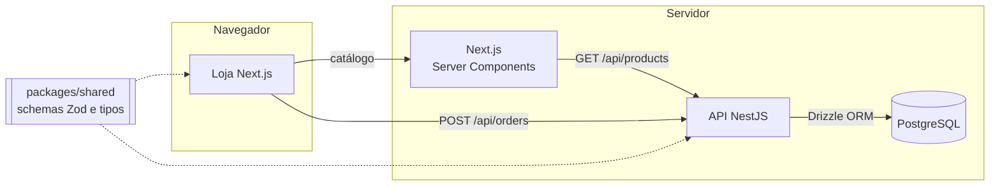

# OTILC Store

[](https://github.com/devpedroeduardo/otilc-store/actions/workflows/ci.yml)


Loja completa da **OTILC**, marca de roupas streetwear. Monorepo com API em NestJS, loja em Next.js e PostgreSQL.

É a segunda etapa do produto. A primeira foi a [vitrine da pré-venda](https://github.com/devpedroeduardo/otilc-landing): um site estático, sem build, que validou a marca e fechava os pedidos pelo WhatsApp. Quando a loja precisou de estoque controlado e pedidos de verdade, veio este projeto, que reaproveita a identidade visual e os dados do Drop 00.

> **Status:** em desenvolvimento. Catálogo, carrinho e criação de pedidos com reserva de estoque já funcionam. Pagamento por Pix e painel administrativo estão no [roadmap](#roadmap).

## Arquitetura



```
apps/
├── api/        # NestJS: catálogo, pedidos, reserva de estoque
│   ├── drizzle/          # migrations SQL versionadas
│   ├── src/db/           # schema, conexão, migrate e seed
│   ├── src/catalog/      # listagem, filtros, detalhe
│   ├── src/orders/       # criação de pedido, reserva e expiração
│   └── test/             # testes de integração com Postgres real
└── web/        # Next.js (App Router): vitrine, produto, carrinho e checkout
packages/
└── shared/     # schemas Zod, tipos e regras puras usadas pela API e pela loja
```

## Destaques técnicos

**Estoque que não vende a mesma peça duas vezes.** Cada peça seminova tem uma unidade só. A reserva é um `UPDATE` condicional (`stock - reserved >= quantidade`) dentro da transação do pedido. O Postgres trava a linha durante o update, então, entre duas compras simultâneas da última unidade, só uma passa e a outra recebe `409`. Um teste de integração dispara **10 pedidos simultâneos** para a mesma peça e confirma que exatamente um é criado.

**Regras garantidas no banco, não só no código.** Restrições `CHECK` impedem estoque negativo, reserva maior que o estoque, preço zerado e condição fora de 0 a 10. Mesmo um bug na aplicação não consegue gravar esses estados.

**O preço nunca vem do navegador.** O checkout envia só a variação e a quantidade. A validação com Zod descarta qualquer campo extra, e a API calcula o total com os preços do banco. O pedido guarda nome, tamanho e preço do momento da compra.

**Reserva com prazo.** O pedido segura o estoque por 30 minutos (configurável). Um job a cada minuto devolve ao estoque as unidades de pedidos não pagos. Ele usa `FOR UPDATE SKIP LOCKED`, então várias instâncias da API podem rodar ao mesmo tempo sem processar o mesmo pedido duas vezes.

**Transação tudo ou nada.** Se um item do carrinho não tem estoque, nenhum outro é reservado. Os itens são travados sempre na mesma ordem para evitar deadlock.

**Validação compartilhada.** Os mesmos schemas Zod de `packages/shared` validam a entrada na API e mostram os erros no formulário da loja antes do envio.

**Segurança da API:** Helmet, CORS restrito à origem da loja, limite de requisições por IP (mais baixo na criação de pedidos), corpo limitado a 20 kB, IDs de pedido em UUID aleatório e variáveis de ambiente validadas na inicialização.

**Vitrine com a mesma regra da pré-venda.** Peças reservadas e vendidas continuam visíveis, em cinza e no fim da grade, como prova de que as peças saem.

## Stack

| Camada         | Tecnologias                                               |
| -------------- | --------------------------------------------------------- |
| API            | NestJS 11, TypeScript, Zod, Helmet, @nestjs/throttler     |
| Banco de dados | PostgreSQL 16, Drizzle ORM e migrations SQL (drizzle-kit) |
| Loja           | Next.js 15 (App Router, Server Components), React 19      |
| Monorepo       | npm workspaces e Turborepo                                |
| Testes         | Jest, Supertest, node:test                                |
| Infra          | Docker (multi-stage), Docker Compose, GitHub Actions      |

## Como rodar

Requer Node 22 e Docker (ou um PostgreSQL 16 local).

```bash
npm install
docker compose up -d db                 # sobe o Postgres
cp apps/api/.env.example apps/api/.env
cp apps/web/.env.example apps/web/.env.local
npm run db:migrate                      # cria as tabelas
npm run db:seed                         # carrega as 17 peças do Drop 00
npm run dev                             # API em :3333 e loja em :3000
```

Para subir tudo em contêineres: `docker compose up --build`.

### Endpoints

| Método | Rota                  | Descrição                                                 |
| ------ | --------------------- | --------------------------------------------------------- |
| GET    | `/api/health`         | Situação da API e do banco                                |
| GET    | `/api/categories`     | Categorias                                                |
| GET    | `/api/products`       | Catálogo com `categoria`, `ordem`, `pagina` e `porPagina` |
| GET    | `/api/products/:slug` | Detalhe com variações e unidades disponíveis              |
| POST   | `/api/orders`         | Cria o pedido e reserva o estoque                         |
| GET    | `/api/orders/:id`     | Consulta o pedido                                         |

## Testes

```bash
npm test             # unitários: regras compartilhadas, mapeamento do catálogo, configuração
npm run test:e2e     # integração da API com Postgres real (TEST_DATABASE_URL)
```

Os testes de integração cobrem o catálogo (filtros, ordenação, paginação, 404 e entrada malformada) e os pedidos (preço calculado no servidor, 10 compras simultâneas, rollback de carrinho parcial, variação inexistente e expiração de reserva).

O CI roda formatação, tipos, testes unitários, testes de integração com um Postgres de serviço e o build da API e da loja a cada push.

## Roadmap

- [x] Monorepo, CI e Docker
- [x] Catálogo com filtros, ordenação e paginação
- [x] Carrinho e criação de pedido com reserva de estoque à prova de concorrência
- [x] Expiração de pedidos não pagos
- [ ] Pagamento por Pix com Mercado Pago (sandbox), com webhook verificado por assinatura e idempotente
- [ ] Painel administrativo: produtos, fotos, estoque por variação e pedidos
- [ ] Login de administrador com cookie httpOnly e permissões por papel
- [ ] E-mail de confirmação do pedido
- [ ] Testes E2E do fluxo de compra com Playwright
- [ ] Deploy: loja na Vercel, API no Render e banco no Neon

## Licença

Código sob licença MIT. Nome, logotipo e fotos são da marca OTILC e não estão incluídos nessa licença.
